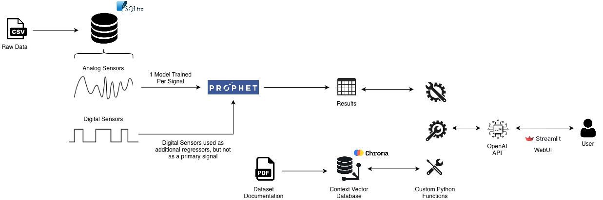

# Building An Agentic System for Explainable Anomaly Detection
**Georgia Institute of Technology, Fall 2025 Practicum**

**Student:** Tung Nguyen (tnguyen844@gatech.edu, tungtngyn@gmail.com)

**Project:** Textual Explanation for Time Series Fault Detection

**Sponsor:** Sentinel Devices


<br>


# Deliverables

## A. Working Prototype

This repository provides two versions of the prototype: a Jupyter notebook and a Streamlit webapp. 

* The Jupyter notebook (`./01_inference.ipynb`) contains all the code required for running the inference workflow and illustrates how the process works internally.
* The Streamlit webapp (`./04-app/*`) is a more polished, production-ready interface that can be run using a single command: `streamlit run app.py`.

To run either prototypes, follow the setup instructions in the next section.

This project also includes supplemental work (outside of the final deliverables) inside `./02_unsupervised_model_tuning.ipynb`. This Jupyter notebook contains proof-of-concept code for parallel model training and unsupervised model tuning using Bayesian optimization + synthetic anomaly generation. Please read the report (`./reports`), Section 4 - Supplemental Work, for more details.

### Google Colab

The inference notebook (`01_inference.ipynb`) is also provided as a runnable Google Colab notebook [here](https://drive.google.com/drive/folders/1Vk6pBK44Ix-lIV-R_t0L3_fzxyOg3xpn?usp=share_link). 

## B. Documentation

### Setup

The prototype code (both Jupyter notebook and Streamlit app) requires the following components:

* An OpenAI API Key
* A ChromaDB Vector Database (`./02-data/chroma_db/*`)
* A SQLite3 Results Database (`./02-data/data.db`)

In an environment file (`.env`) one folder up from the current directory (i.e., `../.env`), add your OpenAI API Key:

```
OPENAI_API_KEY="sk..."
```

Create a Python virtual environment using `./requirements.txt`:

```bash
python -m venv ./sentinel-devices

pip install -r requirements.txt
```

To set up the ChromaDB and Results DB, run all of the code in `./00_setup_and_model_training.ipynb` (might take a long time). Or alternatively, download the database files from [this Google Drive folder](https://drive.google.com/drive/folders/1Vk6pBK44Ix-lIV-R_t0L3_fzxyOg3xpn?usp=share_link). The Google Drive also contains the model files for reference. These model files are not used in either prototypes since results are already written to the SQLite3 DB. 

**These files will be deleted from the Google Drive at the end of Dec 2025 to clear up space.**

### Prototype

Once downloaded (or setup code has completed running), 

* All the code in `./01_inference.ipynb` should be able to be run.
* The Streamlit app can be started by opening a terminal window, activating the virtual environment, navigating to the `./04-app` folder, then running `streamlit run app.py`

If issues are encountered, please reach out to `tungtngyn@gmail.com`.

### Technical Architecture

The diagram below shows the flow from raw dataset to user explanation. It is a visual representation of `./00_setup_and_model_training.ipynb` + `./04-app`.



**Technologies Used:**
* The entire project was built in Python.
* Tabular data processing was done using `pandas` and `sqlite3`.
* Retrieval Augmented Generation (RAG) was done using: `langchain` / `pypdf` for PDF parsing and chunking, `langchain-openai` for embeddings, and `langchain_chroma` for the vector database & similarity search.
* Anomaly detection was performed using `prophet` + pure python code.
* User interface was built using `streamlit`.

## C. Demonstration

A video demo of the Streamlit app is provided [here](https://www.youtube.com/watch?v=GOR1r17o70s). The video demonstrates how the LLM is capable of querying, aggregating, and even plotting data. 

The application should look like this: 


When asked to plot, the LLM will generate the plot and save it in the `/04-app/imgs` folder. The generated image will also be appended to the chat history:


## D. Write-Up

A 4-page report summarizing the project work and notable findings is provided in the `./reports` folder.

The Georgia Tech version of the report (longer, more detailed) is also available upon request. Please email `tungtngyn@gmail.com`.


<br>


# Appendix: Repository Structure Documentation

## Folders

* `00-dev-files`: Contains a series of Jupyter notebooks used during initial experimentation and model evaluation. The majority of the code in these Jupyter notebooks are not final and should be considered development code. Plots, models, and metrics shown in the report were generated in `03_modeling_f1.ipynb`, `04_metrics_f1.ipynb`, and `05_plotting.ipynb`.
* `01-docs`: Contains the MetroPT dataset's research paper + Sentinel Devices project syllabus.
* `02-data`: Contains the ChromaDB and SQLite3 Results DB. The files in this folder are omitted due to their size. Download the databases from the Google Drive linked above or regenerate them using the code in `./00_setup_and_model_training.ipynb`.
* `03-models`: Contains trained model files. Omitted due to size. Download model files from the Google Drive linked above or regenerate them using the code in `./00_setup_and_model_training.ipynb`.
* `04-app`: Streamlit webapp code.
* `output`: Output folder for plots and logs generated in `./01_inference.ipynb` and `./02_unsupervised_model_tuning.ipynb`.
* `raw-data`: Contains raw CSV data for the MetroPT dataset. Omitted due to size. Download the raw data [here](https://zenodo.org/records/6854240).
* `reports`: Contains the project report PDF.


## Notebooks & Utils

These top-level notebooks provide cleaned-up versions of the code inside `00-dev-files`.

* `./00_setup_and_model_training.ipynb`: Sets up Chroma DB, Results DB, trains Prophet models, and saves Prophet results in application-ready tables.
* `./01_inference.ipynb`: Connects to OpenAI API, ChromaDB, and Results DB for inference using LangGraph.
* `./02_unsupervised_model_tuning.ipynb`: Proof-of-concept code for parallel model training, unsupervised model tuning (synthetic anomaly generation, bayesian optimization).
* `./utils.py`: Utilities for inference + parallel model training. Used by the Jupyter notebooks above.
